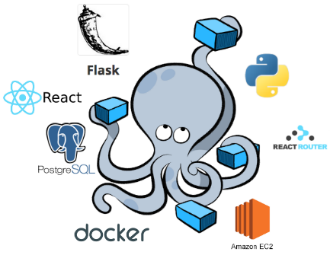

### Setup Inicial da Aplicação

#### 1- Criando uma Aplicação Node Trabalhando Camada Model;

#### 2- Fazer a Integração da Aplicação com Gerenciador de Banco Dados MYSQ:

### Ferramentas e Pacotes Utilizados:

- [x] - FrameWork Express ;
- [x] - nodemom;
- [x] - Mysql;
- [x] - MySQL Workbench (Ferramenta Gráfica);
- [x] - Client que faz a conexão do Node com o Mysql (msql2); 
- [x] - body-parse;

#### 3 - Comandos Utilizados instalação:

- [x] - npm i nodemon -D;
- [Link Pacote Nodemon ](https://duckduckgo.com)
  > Obs.: O D MAIÚSCULO é informa que é uma forma contraída de dizer que é uma Dependência de 
  > Desenvolvimento, ou seja, na hora de subir para a produção essa dependência não tem importancia para 
  > o bom funcionamento da minha aplicação, essa dependencia é somente para testes no momento do 
  > desenvolvimento.
 
- [x] - npm i express;
- [Link Express ](https://www.npmjs.com/package/express)
 
- [x] - npm install --save mysql2
 > Client Utilizado para fazer a conexão de uma palicação Node Com Mysql (connector);
 
- [x] - npm i body-parser
  > Middleware de análise do corpo do Node.js.
  > Analise os corpos de solicitação de entrada em um middleware antes de seus manipuladores,
  > disponíveis na propriedade req.body.
- [Body-Parse](https://www.npmjs.com/package/body-parser)
  
 ##### Código que faz a conexão entre Node e Mysql 
```javascript
// get the client
const mysql = require('mysql2/promise');

// Create the connection pool. The pool-specific settings are the defaults
const connection = mysql.createPool({
  host: 'localhost',
  user: 'root',
  database: 'Books',
  password:'senha'
});
```

- [x] - npm i express-rescue;
    > Este é um wrapper livre de dependência (ou camada de código de
    > .açúcar, se você preferir) para middlewares assíncronos que
    > garante que todos os erros assíncronos sejam passados ​​para
    > sua pilha de manipuladores de erros, permitindo que você tenha
    > um código mais limpo e legível.
- [x] [Link Express-Rescue ](https://www.npmjs.com/package/express-rescue)
- [x] [Instalando MySQL Shell ou Linux](https://dev.mysql.com/doc/mysql-shell/8.0/en/mysql-shell-install-linux-quick.html)
  > OBSERVAÇÃO: Uma alternativa caso não tenha o mysql instalado em seu PC é instalar o docker, caso 
  > tenha o docker intalado use o arquvivo abaixo para suspender um container com micro-serviço do 
  > gerenciador de banco de dados mysql:

  
   ###### Dentro do VS Code ou editor da sua  preferencia, criar uma arquivo docker-compose.yml,
   ###### cole o codigo abaixo dentro do arquivo docker-compose.yml.
  
  ```yml
  version: "3.1"
  services:
  mysql:
    image: mysql:5.7
    container_name: container-mysql
    environment:
      - MYSQL_ROOT_PASSWORD=admin
    ports:
      - 3308:3306
  ```
##### No terminal do VS Code rode o comando abaixo para criar o micro-serviço 

```console
docker-compose up -d
```
  
- [x] [Instalando MySQL Workbench](https://dev.mysql.com/doc/workbench/en/wb-installing-linux.html)

#### 4 - Para Automatizar o nodemon:

> Bem para automatizar o nodemon iremos acessar o package.json, e no sub-objeto scripts iremos adicionar a seguinte insturação:

```json
"scripts": {
  "test": "echo \"Error: no test specified\" && exit 1",
  "dev": "nodemon index.js"
},
```

#### 5- Sobre Execução da Aplicação:

> Para executarmos a aplicação iremos executar o comando abaixo:

```console
npm run dev
```

> OBSERVAÇÃO IMPORTANTE: A ferramenta nodemom é muito útil no
> desenvolvimento de aplicações, porém em produção podemos ter
> problemas de reinicialização da aplicação, devido ao fato que
> qualquer alteração sofrida em um dado arquivo afeta toda
> aplicação.
> Para produção configure seu package.json colocando no objeto
> Script node index.js

```json
"scripts": {
   "script":"node index.js",
  "test": "echo \"Error: no test specified\" && exit 1",
//    "dev": "nodemon index.js"

},
```

# MYSQL - Workbench:


#### Para esse Mini-Projeto iremos utilizar scripts abaixo para montar nosso DB(Data Base):

>

```sql
CREATE DATABASE Books;
USE Books;

CREATE TABLE books (
    id INT NOT NULL AUTO_INCREMENT,
    title VARCHAR(90) NOT NULL,
    author_id INT(11) NOT NULL,
    PRIMARY KEY(id)
);

INSERT INTO books (title, author_id)
VALUES
    ('A Game of Thrones', 1),
    ('A Clash of Kings', 1),
    ('A Storm of Swords', 1),
    ('The Lord of The Rings - The Fellowship of the Ring', 2),
    ('The Lord of The Rings - The Two Towers', 2),
    ('The Lord of The Rings - The Return of The King', 2),
    ('Foundation', 3)

```
