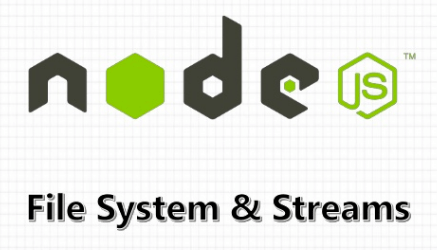

### Setup Inicial da Aplicação

#### 1- Demonstrando Hello Workd em Express;
#### 2- Dependencias ou Pacotes Instalados:

- [x] - FrameWork Express ;
- [x] - nodemom ;
- [x] - express-rescue; 

#### 3 - Comandos Utilizados instalação:

- [x] - npm i nodemon -D;
- [Link Pacote Nodemon ](https://duckduckgo.com)
  > Obs.: O D MAIÚSCULO é informa que é uma forma contraída de dizer que é uma Dependência de Desenvolvimento, ou seja, na hora de subir para a produção essa dependência não tem importancia para o bom funcionamento da minha aplicação, essa dependencia é somente para testes no momento do desenvolvimento.
- [x] - npm i express;
- [Link Express ](https://www.npmjs.com/package/express)
- [x] - npm i express-rescue;
  > Este é um wrapper livre de dependência (ou camada de código de 
  > .açúcar, se você preferir) para middlewares assíncronos que 
  > garante que todos os erros assíncronos sejam passados ​​para 
  > sua pilha de manipuladores de erros, permitindo que você tenha 
  > um código mais limpo e legível.

- [Link Express-Rescue ](https://www.npmjs.com/package/express-rescue)
  
#### 4 - Para Automatizar o nodemon:

> Bem para automatizar o nodemon iremos acessar o package.json, e no sub-objeto scripts iremos adicionar a seguinte insturação:

```json
"scripts": {
  "test": "echo \"Error: no test specified\" && exit 1",
  "dev": "nodemon index.js"
},
```
#### 5- Sobre Execução da Aplicação:

> Para executarmos a aplicação iremos executar o comando abaixo:

```console
npm run dev
```

> OBSERVAÇÃO IMPORTANTE: A ferramenta nodemom é muito útil no 
> desenvolvimento de aplicações, porém em produção podemos ter 
> problemas de reinicialização da aplicação, devido ao fato que 
> qualquer alteração sofrida em um dado arquivo afeta toda 
> aplicação.
> Para produção configure seu package.json colocando no objeto 
> Script node index.js

```json
"scripts": {
   "script":"node index.js",
  "test": "echo \"Error: no test specified\" && exit 1",
//    "dev": "nodemon index.js"

},
```

# Módulo fs Nativo node:



#### Uilizando o Módulo fs Nativo do Node para fazer uma leitura Síncrona:

> No arquivo readFileSync.js - Temos a seginte arrow function como descrita
> no código abaixo:
> Explicação: A mesma foi estruturada para fazer a leitura de uma código de forma
> síncrona, para isso ela faz uso do módulo fs nativo do nodejs. O método readFile
> é responsável pela leitura do arquivo onde o mesmo recebe como parâmetro o caminho
> do arquivo './talker.json', o encode 'utf8' e uma callback que por sua vez recebe
> dois parâmetros o de 'error' e 'data' onde ficar armazenado os dados do arquivo lido.
> para o tratamento de erro temos uma condicional if que caso o erro seja true, ou seja,
> existir de fato ela apresentará a mensagem do erro, pois, eu fiz o tratamento desse erro
> com o método message de forma me mostrar uma mensagem relativa ao erro, caso o erro não 
> ocorra retornaremos os dados convertido em json na constante jsonData.

```javascript
const fs = require("fs");

const readFileSync = () => {
  fs.readFile("./talker.json", "utf8", (error, data) => {
    if (error) {
      return console.log(`ERROR: ${error.message}`);
    }
    const jsonData = JSON.parse(data);
    return jsonData;
  });
};
```
